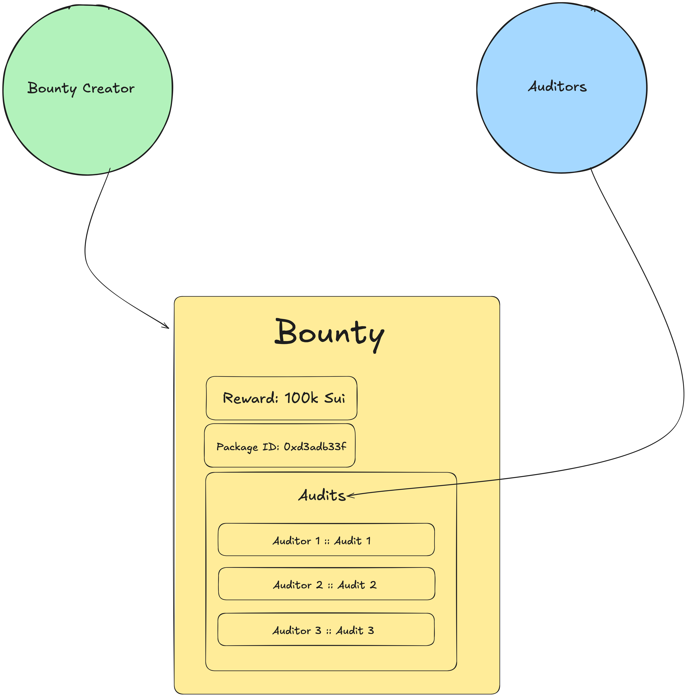
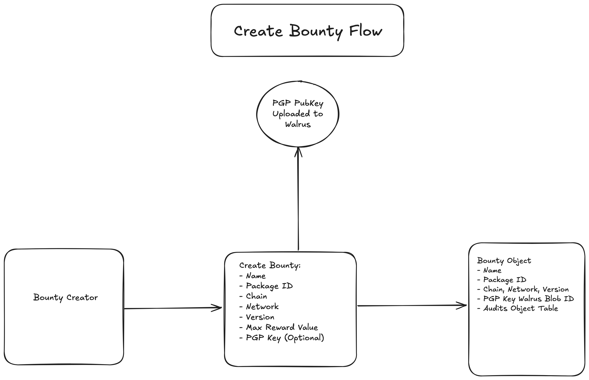
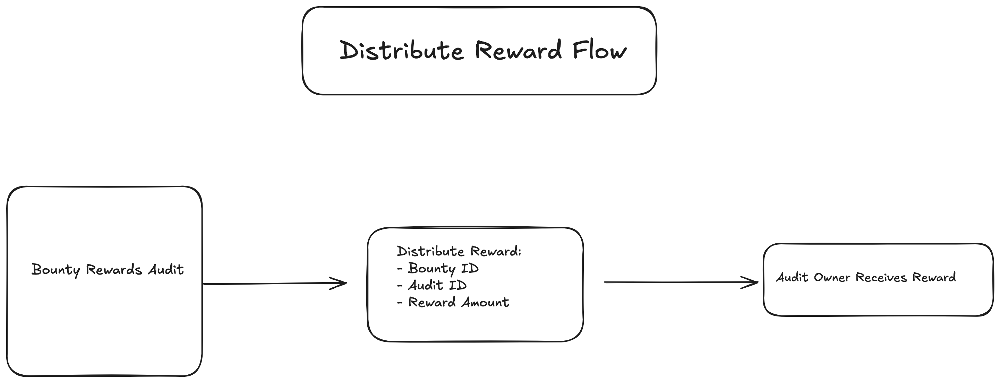
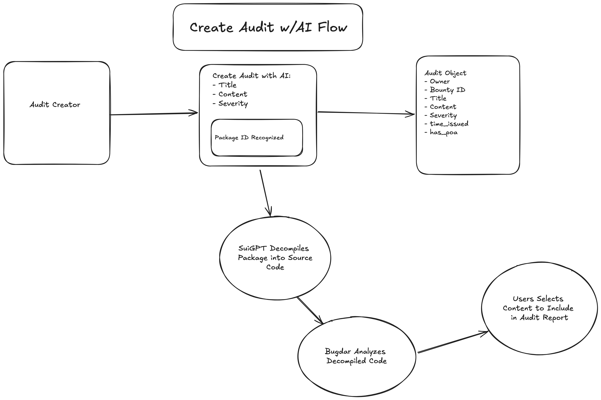

# "The Bug Pub": Web3's First On-Chain Bug Bounty Platform

Welcome to the Bug Pub, a place to reward the right kind of attention.

Bug Pub provides a fully Web3 Bug Bounty Audit Platform for Publishing Bug Bounties and Audits.

Users now have a web3-native service for managing and participating in bug bounties and publishing security-related research / audits on packages

All Bug bounty operations are managed and interfaced via the [Sui](https://sui.io/) Blockchain.

Bug Pub is currently in prototype stages, and can be found here: [bug-pub.vercel.app](https://bug-pub.vercel.app)

## Overview

## Actors + Actions

### Bounty Owner

#### Create Bounty

- Lists their smart contract package on the platform with associated bounty reward
- Generates a Proof of Audit (PoA) NFT for auditer who can use it to submit a higher rated audit (e.g. blue checkmark)
- Sets list of Bounty Verifiers and Bounty Moderators

#### Reward Audits

  - Distribute Rewards for Audits
  
### Security Researchers / Auditors

  - Creates Security Audits Identifying Vulnerabilities in smart contracts and codebases in scope of the bounty
  - Collects rewards for publishing their audits

### Bounty Verifiers
  - Verify Package Bounty Audits
  - Attest Audit is an accurate package analysis report for the package + associated bounty and scope
  - Optionally Rewarded with percentage of Bounty Amount if passes Verification (Opt-In)
  
  
### Bounty Moderators
  - Escalates Quality Content
  - Deletes scam, spam, and unsafe audits

### Informed Consumers
  - Can access audits for smart contracts to make informed decisions
  - Rate audits by casting upvote/downvote

## Technologies Used

### Web3

### Sui Blockchain: Backend Orchestrator for Bug Pub

[Sui Blockchain](https://sui.io/) serves as the primary orchestration layer for Bug Pub services, content, and user interactions.

Bug Pub services are written as Move Packages (smart contracts)

[Move](https://sui.io/move) is the programming language of the Sui Blockchain. It's ease-of-use, modularity, and security features provide an ideal substrate to build secure, scalable, and reactive web3 applications.

#### ZkLogin: Allowing Web2 Seamless Access to Web3

[ZkLogin provides a Web2 Friendly User Login](https://sui.io/zklogin) for Web3 Services (like Bug Pub).
More information can be found at the offical [ZkLogin Docs](https://docs.sui.io/concepts/cryptography/zklogin) and [ZkLogin Research Paper](https://sui.io/zklogin)

### Walrus Storage: Web3 Storage for Bug Pub
[Walrus](https://walrus.sites) is a decentralized storage solution. Bug Pub uses Walrus to store large artifacts not able to be stored on the Sui Blockchain.

### Web2

* NextJS
* Vercel 

## Project Structure
The project is structured into two main directories:
- `app/`: Contains the front-end code.
- `move/`: Includes the smart contracts written in Sui Move.
- `setup/`: Includes helper functionality for publishing Move Contract

